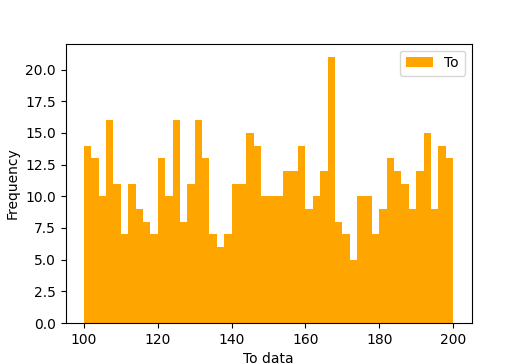
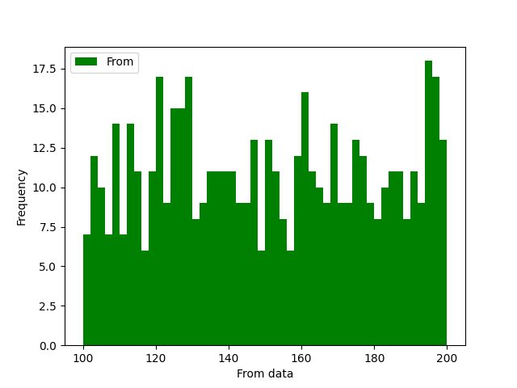
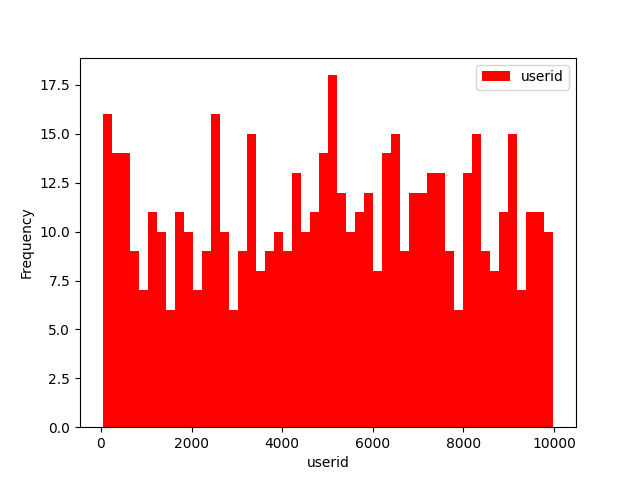
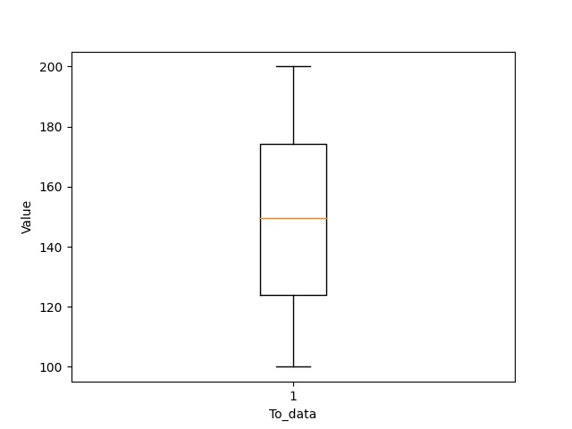
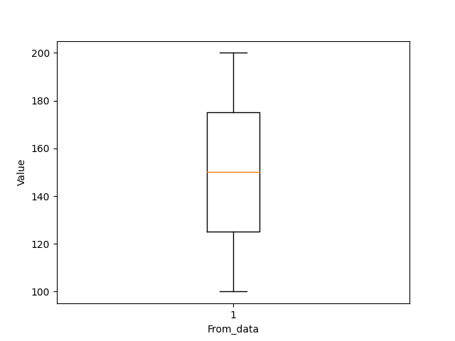
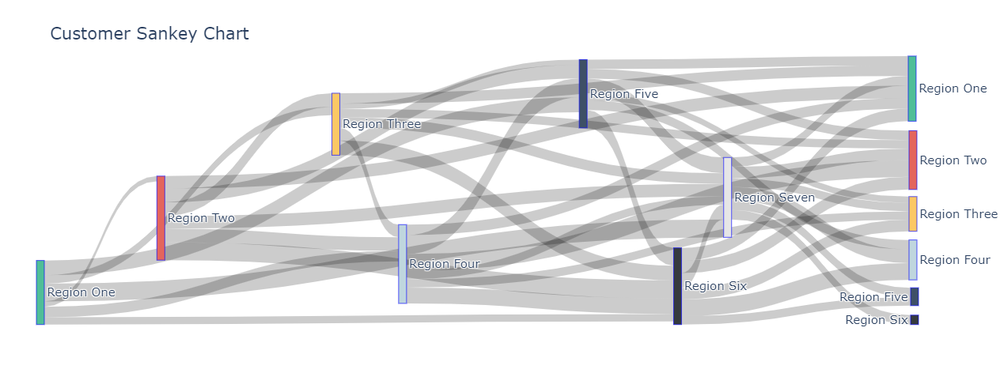
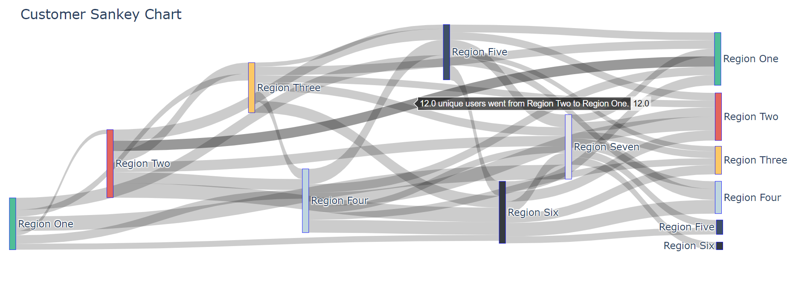
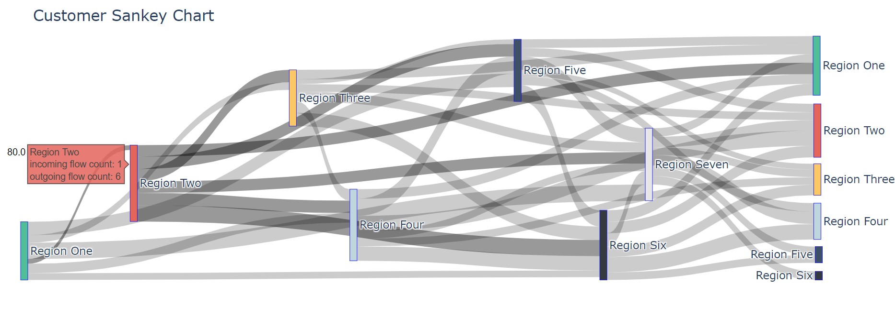

<h1 align="center">
Customer-Data-Visualization-using-Sankey-Chart
</h1>

## Introduction
  The data consists of three columns- userid, To and From. To visualize and analyze the data this data- histograms, boxplots and Sankey Chart has been.

## Histograms
  Histograms allow us to see the frequency of data points that lie within a certain range.

  
## Box plots
- Here, the boxplots of to and from data give us the minimum and maximum values of To and From data which will help us in Plotting the Sankey Chart

## Plotting the Sankey Chart
In order to plot the Sankey chart, the data points need to be divided into regions. We will be plotting will be plotting the __To__ values from the data as source for the Sankey diagram and __From__ values from the data as target. In order to do this, we will need to make regions so that we can **label** the Sankey chart. The following regions or labels have been used for these data values-
  
|       Label       |      Range     | 
|:------------------|:--------------:|
|    Region One     | **100 to 114** | 
|    Region Two     | **115 to 129** |  
|   Region Three    | **130 to 144** |
|    Region Four    | **145 to 159** |   
|    Region Five    | **160 to 174** |   
|    Region Six     | **175 to 189** |
|   Region Seven    | **190 to 204** |   

  As you can see, a difference of 15 is used to divide the data points into these regions. We will be using this to rank the region of both __To__ and __From__ data.
  
## Sankey Chart
  We can see the following Sankey chart below-
  

  
  In order to find out the number of unique users that have gone from one region to another, just hover the arrow over the flow path. Here we can see that **12 unique users** have gone from **Region Two to Region One**.
  

  
  The **incoming flow count**, **outgoing flow count** and the **total number of users** passing through any region can be found out by clicking on the label itself. Here we can see that the total number of unique users passing through __Region Two__ is **80**.
  

  
## Primary packages Used
- pandas
- matplotlib
- plotly

## References
- [Sankey diagram using Plotly](https://plotly.com/python/sankey-diagram/)
- [Sankey diagrams in Python](https://towardsdatascience.com/visualizing-in-app-user-journey-using-sankey-diagrams-in-python-8373a7bb2d22)
- [Lambda and Apply function](https://towardsdatascience.com/apply-and-lambda-usage-in-pandas-b13a1ea037f7)
- [Axis in pandas](https://www.dataday.life/notes/data-engineering-python/difference-between-axis-0-axis-1-python-pandas/)
  
## Contributors
<table>
  <tr>
    <td align="center">
      <a href="https://github.com/shantanhunt">
          
           
          <b>Shantanu Sontakke
</b>
      </a>
  </tr>
</table>
